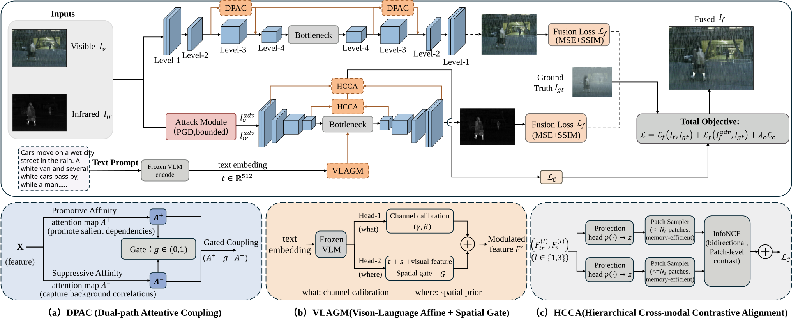

# Dual-Path Attentive Fusion with Vision–Language Guidance under Adversarial Perturbations

This is the official project page for the paper:
## Overall Framework

The overall architecture and training objective are summarized below:

